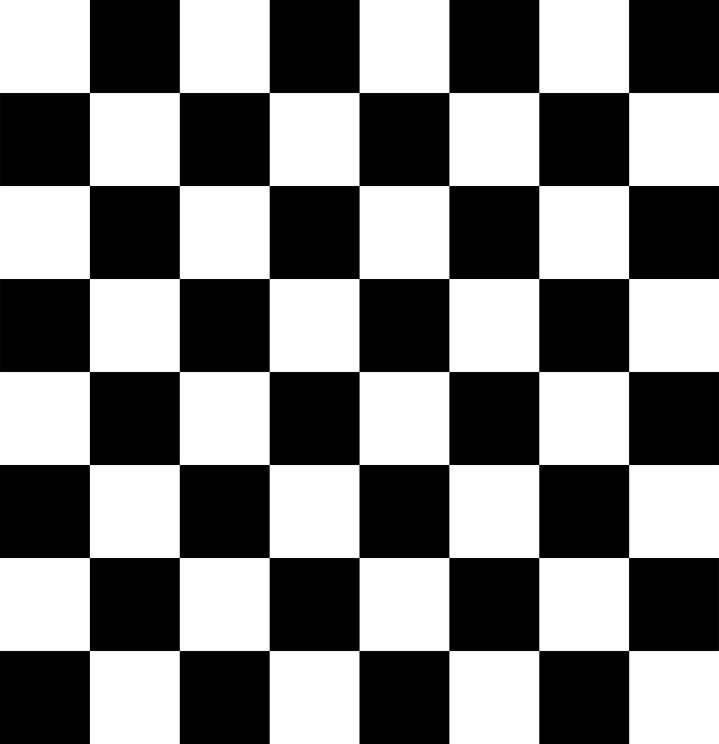
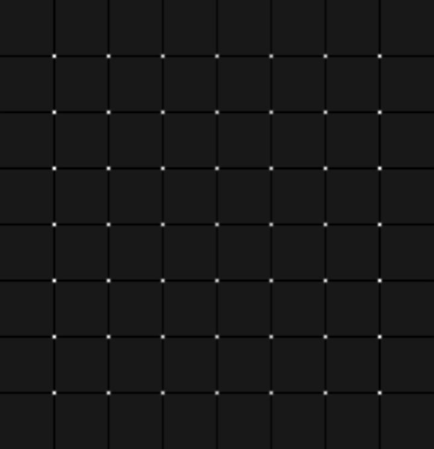
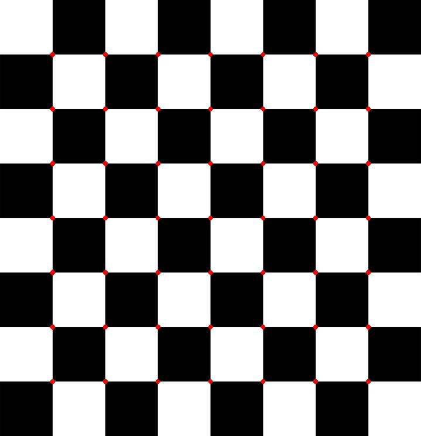

# Harris corner detection

This project used C++ to implement Harris corner detection algorithm [1]. The basic idea is to find the maxima change $E$ produced by a shift $ (x,y) $ is given by:

$$ E_{x,y} = \sum_{u,v}w_{u,v}[I_{x+u,y+v}-I_{u,y}]^2.\qquad(1)$$

where $I$ is image intensities and $w$ specifies a weight function to smooth noise, for example a Gaussian:

$$ w_{u,v} = exp(-(u^2+v^2)/2\sigma^2).\qquad(2) $$

In Eq. (1), the shifting image intensity is approximated by Tayler expansion:

$$ I_{x+u,y+v} \approx I_{u,v}+xX+yY.\qquad(3) $$

where $X$ and $Y$ are first gradients. So, we can rewrite Eq. (1):

$$ \begin{align*} 
    E_{x,y} & \approx \sum_{u,v}w_{u,v}[I_{u,v}+xX+yY-I_{u,v}]^2,\qquad \\
    & \approx \sum_{u,v}w_{u,v}[xX+yY]^2,\qquad \\ 
    & \approx \sum_{u,v}w_{u,v}\left[\begin{matrix}(X\;Y)\begin{pmatrix}x \\ y\end{pmatrix}\end{matrix}\right]^2,\qquad\\
    & \approx \sum_{u,v}w_{u,v}(x\;y)\begin{pmatrix}XX & XY \\ XY & YY\end{pmatrix}\begin{pmatrix}x \\ y\end{pmatrix},\qquad \\
    & \approx (x\;y)\begin{pmatrix} \sum_{u,v} XX & \sum_{u,v} XY \\ \sum_{u,v} XY & \sum_{u,v} YY\end{pmatrix}(x\;y)^T,\qquad \\
    & \approx (x\;y)\begin{pmatrix} A & C \\ C & B\end{pmatrix}(x\;y)^T,\qquad \\
    & \approx (x\;y)M(x\;y)^T.\qquad(4)
\end{align*} $$

where $M$ is the covariance matrix for $X$ and $Y$. To avoid the explicit eignvalue decomposition of $M$, the corner response function is defined as following:

$$ \begin{align*} 
    R &= Det(M) - k\;Tr(M)^2.\qquad(5)\\
      & Det(M) = AB-C^2. \\
      & Tr(M) = A+B.
\end{align*} $$

where $k$ is a constant, the range is [0.04, 0.06].

# Results
* Input image:

    

* Response:

    

* Result:

    

# Prerequisite library
* [libjpeg](https://libjpeg.sourceforge.net/)

# How to build and run
```bash
cd samples/harris
make
./harris
```

# Reference

[1] [wikipedia](https://en.wikipedia.org/wiki/Harris_corner_detector)